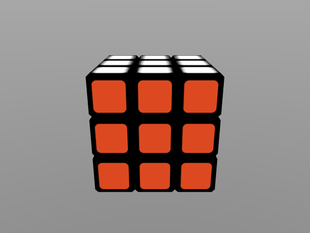

# MuJoCo 3x3x3 Puzzle Cube

[![build][tests-badge]][tests]
[![build][mujoco-version]][MuJoCo]

[tests-badge]: https://github.com/kevinzakka/mujoco_cube/actions/workflows/ci.yml/badge.svg
[tests]: https://github.com/kevinzakka/mujoco_cube/actions/workflows/ci.yml
[mujoco-version]: https://img.shields.io/badge/MuJoCo-v3.1.0-blue

[MuJoCo] model of a 3x3x3 puzzle cube, along with a script to procedurally generate it. Inspired by the [Rubik's Cube].

<p float="left">
  
</p>

## Requirements

You will need MuJoCo version 3.1.0 or greater to run the model. If you want to use an older version, replace the `implicitfast` integrator with `Euler`.

## Play with the model

Just drag and drop the `cube_3x3x3.xml` file into the simulate window.

## Generate the model

Dependencies are managed with [uv](https://docs.astral.sh/uv/). Run the following to
generate the texture atlas and XML file:

```bash
uv run build_textures.py  # Creates assets/sticker.png.
uv run build_mjcf.py      # Creates cube_3x3x3.xml.
```

The whole model uses a single UV-mapped sticker atlas (`assets/sticker.png`) and a
single material. Each cubelet is a mesh carrying texture coordinates that map its
faces into the right color swatch; the chamfered bevels map into the black swatch.

## Cubelet design

Solidworks was used to design `cubelet.stl`. It has a dimension of 1.9 cm with chamfered edges of length 1.425 mm. The cube was exported as an STL file and processed with `process_mesh.py` to obtain the vertices for the `mesh` attribute in the MJCF file.

[MuJoCo]: https://github.com/deepmind/mujoco
[Rubik's Cube]: https://en.wikipedia.org/wiki/Rubik%27s_Cube
